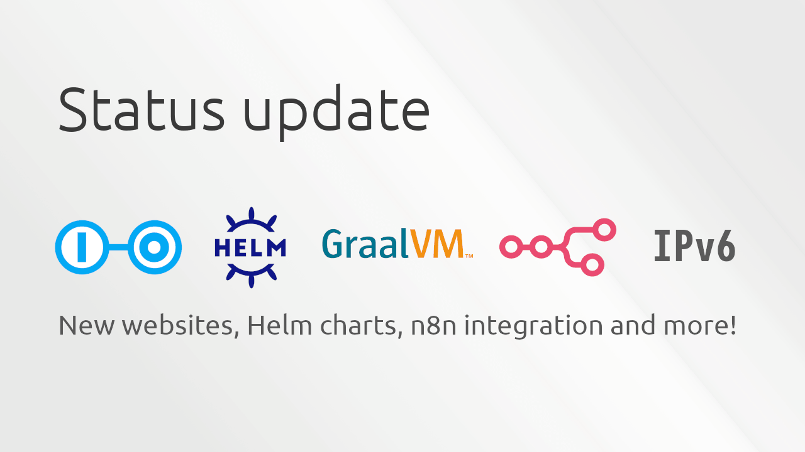

Over the past few months, we've been busy refactoring the Scoold and Para code bases.
The two projects were migrated to Spring Boot 4.x and lots of legacy code has been removed.
Para no longer uses Guice for dependency injection and AOP. This allowed us to improve performance,
decrease package size and enabled easier native compilation. Additionally, the core Para library was
simplified and the AWS SDK dependency was removed as well.
We've added a new Helm chart for Para with customizable secret keys and more.

<!-- more -->



## New Websites

Both [scoold.com](https://scoold.com) and [erudika.com](https://erudika.com) have been completely redesigned with modern web technologies. 
The new sites are built with [Astro](https://astro.build), styled with [Tailwind CSS](https://tailwindcss.com) 
and [DaisyUI](https://daisyui.com), delivering faster page loads, better SEO, and an improved user experience across all devices.
Scoold now has a beautiful documentation website with much better clarity than what was previously possible with its single-file `README.md` on GitHub.
We're planning to update the Para documentation soon as well, but first we will focus on shipping the Scoold and Para MCP servers.

## New Helm Charts

Para has a brand new Helm chart and the charts for Scoold and Scoold Pro have been updated as well.

- [↗ Helm chart for Para repo](https://github.com/Erudika/para/tree/master/helm), [↗ link to Artifact Hub](https://artifacthub.io/packages/helm/erudika/para)
- [↗ Helm chart for Scoold repo](https://github.com/Erudika/scoold/tree/master/helm), [↗ link to Artifact Hub](https://artifacthub.io/packages/helm/erudika/scoold)
- [↗ Helm chart for Scoold Pro repo](https://github.com/Erudika/scoold-pro/tree/master/helm), [↗ link to Artifact Hub](https://artifacthub.io/packages/helm/erudika/scoold-pro)

The new Para Helm chart makes it easier than ever to deploy Para on Kubernetes. It includes support for customizable secret keys through `rootSecretOverride`,
allowing you to inject predetermined secrets for the root app on first run. The chart also supports running Para with plugins and JDBC drivers using
`initContainers` - for example, you can configure Para to use the SQL plugin and connect to PostgreSQL by downloading the necessary JARs before the
cluster initializes. This eliminates manual plugin setup and provides a fully declarative deployment experience.

## GraalVM native images

Both Para and Scoold now support compilation to native images using GraalVM. Native images offer much faster cold startup times and significantly
lower memory footprint compared to traditional JVM deployments - ideal for containerized environments and resource-constrained systems.

Compiling Para to a native image is straightforward with Maven. Make sure you have GraalVM installed, then run:

```bash
mvn -Pnative clean package
```

This produces a standalone native executable that starts in milliseconds instead of seconds. Scoold supports the same workflow -
see the [Kubernetes deployment documentation](https://scoold.com/documentation/deployment/kubernetes/) for details on building and deploying native images in production.

## IPv6

We've updated [Para Cloud](https://paraio.com) and [Scoold Cloud](https://cloud.scoold.com) to support IPv6 connectivity.
The services are running in dualstack mode on AWS. We experimented with ipv6-only deployments but it's still too early for that since not all AWS services fully support ipv6.
You can now connect to those services via IPv6, but keep in mind that for some reason the latency on IPv6 connections to AWS are much higher than those of IPv4 connections.

## Integration with n8n

We've published the official [Scoold community node for n8n](https://www.npmjs.com/package/@erudika/n8n-nodes-scoold)!
You can now automate your knowledge base workflows by connecting Scoold to hundreds of apps and services - Slack, Jira, GitHub, Google Sheets, email,
and more - all without writing a single line of code.

The package provides two nodes:

- **Scoold Trigger** - starts workflows when Scoold events fire (new questions, answers, comments, reports, etc.)
- **Scoold** - create, read, update, and delete posts, comments, tags, and reports; search content

The trigger node automatically registers webhooks in Scoold when workflows are activated, and the action node gives you full API access
with built-in authentication, pagination, and error handling. You can build powerful automations like unanswered question reminders,
automated spam moderation, knowledge base mirrors to Google Sheets, and weekly digest emails.

Read more about the integration in our [detailed blog post](https://scoold.com/blog/scoold-now-integrates-with-n8n/) or check
out the [full documentation](https://scoold.com/documentation/integrations/n8n/).

*If you liked this post, you can try out Scoold at [cloud.scoold.com](https://cloud.scoold.com) or chat with me
[on Gitter](https://gitter.im/Erudika/para).*
