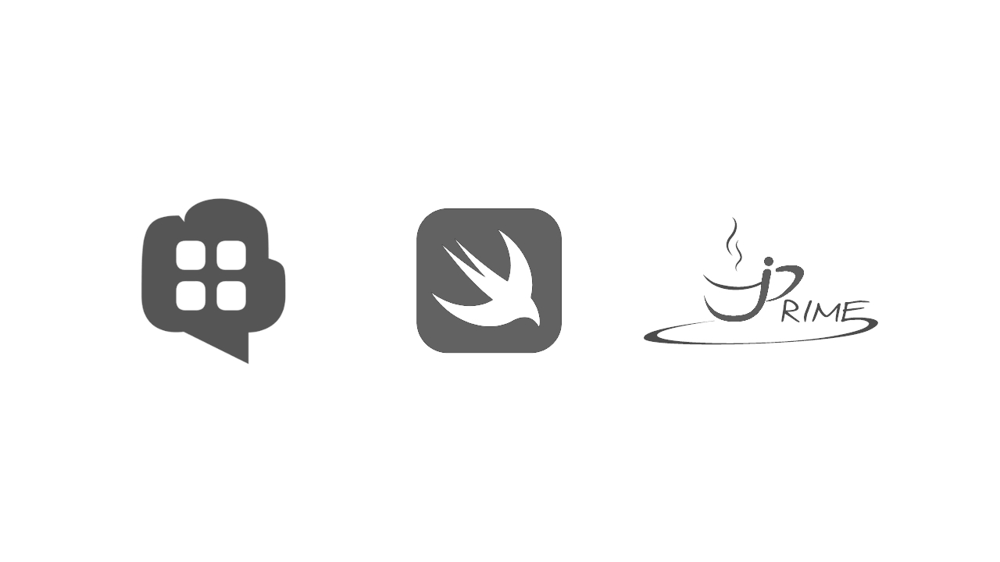

Last week was [jPrime 2016](https://jprime.io), the biggest Java conference on the Balkans. It was a huge success — more than 500 visitors, two tracks in two days. The slogan was *"Java - 21 and legally drunk"* and the two main themes were **microservices** and **reactive programming** with RxJava. This was the second year in a row for the conference which is organized by the community, i.e. fellow Java developers from the BGJUG. By being silver sponsors, we made a humble contribution which helped the community organize this great event.

<!-- more -->



I really liked the talk by Kees Jan Koster where he explained what it is that distracts us from coding and how we can focus on getting things done and not spend too much time in meetings. Later, Hrvoje Crnjak talked about RxJava and how it could be used to make our applications more reactive. And on the second day I really enjoyed the talk on Go by Stoyan Rachev.


Just before jPrime, we released a [client library](https://github.com/Erudika/para-client-ios) for Para that works with iOS devices, including tvOS and OS X. It is written in Swift and is [published on CocoaPods](https://cocoadocs.org/docsets/ParaClient). We encountered [a lot of problems with Xcode and CocoaPods](https://stackoverflow.com/a/37374778/108758) along the way - unstable IDE, poor Objective-C interoperability and poor documentation were slowing us down. Personally, I liked Swift and this was my first time using it, but the overall programming experience with Xcode left in me a feeling of unstability and beta-ness. The developer tools for Java and Android are just superior in comparison, and in a way, I'm glad [Java won](https://arstechnica.com/tech-policy/2016/05/google-wins-trial-against-oracle-as-jury-finds-android-is-fair-use/).

Now you can build iOS apps that are powered by Para on the backend:

```swift
import ParaClient
// avoid using the secret key on mobile devices
let client = ParaClient(accessKey: "ACCESS_KEY", secretKey:"")
client.signIn("facebook", providerToken: "fb_access_token", callback: { user in
    if user != nil {
        // success! user is authenticated, JWT token is saved on the device
        // you can now call the API methods
    }
})
```

Finally, we also updated Para to version `1.18.5` which includes a number of [bug fixes](https://github.com/Erudika/para/releases). The release is on Maven Central and you can download the executable [WAR binary file from GitHub](https://github.com/Erudika/para/releases).

*Have questions or suggestions? Chat with us [on Gitter](https://gitter.im/Erudika/para)!*