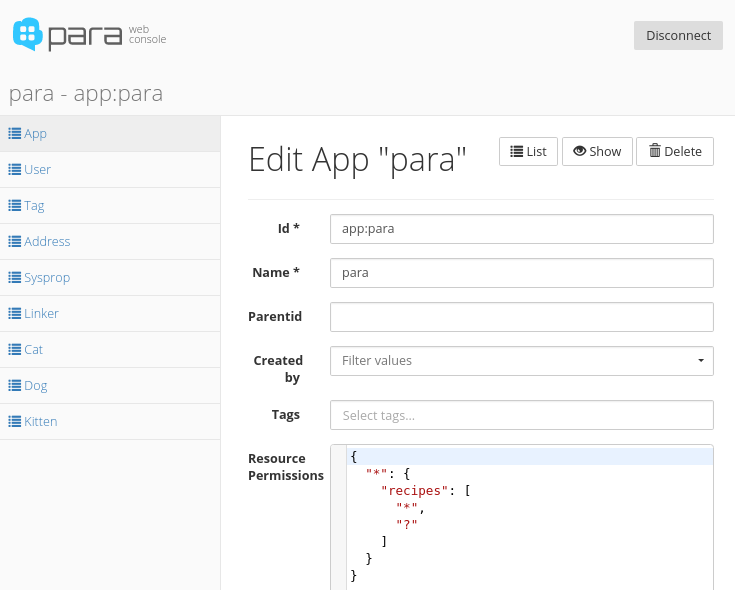
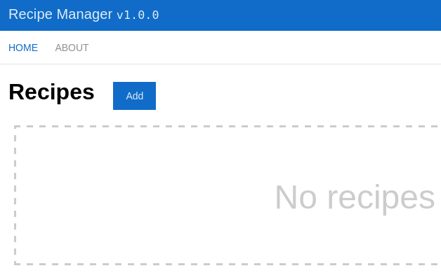
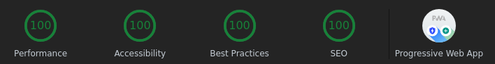

**Note:** This article is a clone of [another one written for Angular](/blog/building-the-stack-from-scratch-with-angular-2).

In this tutorial we're going to build a simple single-page application with **React** (v16 and above). This is intended
for developers unfamiliar with the new framework or having some experience with React. First of all, I got
**Visual Studio Code** installed on my machine and it's running on Linux. I chose VS Code because we'll be working with
**JavaScript** and **JSX** and it has great support for those, but you can code in your favourite IDE as well.
The code project for this article was generated with `create-react-app`, a scaffolding tool for React. 
You'll also need to have **Git**, **Node.js** and **npm** installed.

<!-- more -->


## Step 0 (frontend)

- Get [Visual Studio Code](https://code.visualstudio.com/Download)
- Get [Git](https://git-scm.com/downloads)
- Get [Node.js with npm](https://nodejs.org/en/download/)
- Generate a project with ['create-react-app'](https://create-react-app.dev/docs/getting-started) with `npx create-react-app react-para --use-npm`
- Open the project in the VS Code editor

```bash
npx create-react-app react-para --use-npm 
cd react-para
# watches your files and does live reload
npm start
```

Next - **the backend**. Here, I could write a simple backend in Node.js and Express but I'm lazy so I chose not to.
Instead, I'm going to use **Para** for my backend and I'm not going to write *any* code on the server. If you are
new to Para, it's a general-purpose backend framework/server written in Java. It will save me a lot of time and effort
because it has a nice JSON API for our app to connect to. To run the server you're going to need a Java runtime.

## Step 0 (backend)

- Get [Java](https://jdk.java.net/12/)
- Get [Para](https://paraio.org/)
- Start the server in a separate terminal:

```bash
# run Para
java -jar para-x.y.z.jar
```

Now, check if Para is running - open your browser and go to `http://localhost:8080/v1`. You should see a response like
this:

```json
{
  "info" : "Para - a backend for busy developers.",
  "version" : "x.y.z"
}
```
We haven't got access keys to the server yet, so let's go ahead and do that, open:
```
http://localhost:8080/v1/_setup
```
Save the credentials to a file, we'll need them later to access the backend API.

## Step 1 - API access

Let's create an app for storing recipes - a recipe manager. Our goal will be to build just the basic CRUD functionality,
without adding extra features like authentication and login pages. By default the backend is secured and only signed
requests are allowed, but for the purpose of this tutorial we're going to add a new permission to allow all requests to
just one specific resource - `/v1/recipes`.

Go to [console.paraio.org](https://console.paraio.org) and enter the credentials that you saved in the beginning. Also
click the cog icon to edit the API endpoint and set it to `http://localhost:8080`. Click 'Connect'.

Next, go to 'App' on the left and edit the root app called `para`. You'll see a section for resource permissions and
there you will write a simple permission definition in JSON:

```json
{
  "*": {
    "recipes": ["*", "?"]
  }
}
```

This defines a single permission that allows `* - everyone` to access `/v1/recipes` using a list of allowed methods,
in this case `* - all HTTP methods` and `? - anonymous access` is allowed. Thus, we're essentially making this resource
publicly available. Click 'Save Changes'.



## Step 2 - CRUD recipes

Let's create a new frontend component called `Home.js`.
Now let's edit the 'Home' component in `src/Home.js`:
```js
import React from 'react';

export default class Home extends React.Component {
	constructor(props) {
        super(props);
        this.state = {
            q: '',
            createMode: false,
            recipesList: [],
            editedRecipes: {}
        };
    }
}
```

Let's implement the `render()` function:

```js
render() {
    return (
        <div id="home">
            <h1>My Recipes &nbsp; <button onClick={() => this.newRecipeForm()}>Add</button></h1>
            <div>
                <form onSubmit={this.search}>
                	<label>Search</label>
                    <input type="text" defaultValue="" name="q" placeholder="Search" id="search" />
                </form>
            </div>
            {this.state.recipesList && this.state.recipesList.length === 0 ? <div className="empty-box">No recipes to show.</div> : ""}
            <ul>{this.state.recipesList.map((recipe, index) => <this.RecipeItem key={recipe.id || "new" } recipe={recipe} index={index} />)}</ul>
        </div>
    );
}
```

The `RecipeItem` element is implemented next:

```js
RecipeItem(props) {
    let recipe = props.recipe;
    let index = props.index;
    return (
        <li className="recipe-box">
            <div className={(this.state.editedRecipes[recipe.id] || (!recipe.id && this.state.createMode)) ? "hide" : ""}>
                <h3>{recipe.name}</h3>
                <hr />
                <div>{this.renderMD(recipe.text)}</div>
                <br />
                <button onClick={(e) => this.editRecipe(recipe)}>edit</button> &nbsp;
            <a href="/" onClick={(e) => { this.removeRecipe(recipe.id); e.preventDefault() }} className="red right">remove</a>
            </div>
            <div>
                <form onSubmit={(e) => { this.addRecipe(recipe); e.preventDefault() }} className={((recipe.id || !this.state.createMode) && !this.state.editedRecipes[recipe.id]) ? "hide" : ""}>
                    <div>
                        <input type="text" value={recipe.name} onChange={(e) => this.handleInputChange(e, recipe, index)} placeholder="Title" name="name" />
                    </div>
                    <br />
                    <div>
                        <textarea value={recipe.text} onChange={(e) => this.handleInputChange(e, recipe, index)} rows="10" cols="33" placeholder="Recipe" name="text"></textarea>
                    </div>
                    <button type="submit">
                        <span>{this.state.createMode ? "Add" : "Save"}</span>
                    </button>
                    &nbsp;
                <a href="/" onClick={(e) => { this.closeForm(recipe.id); e.preventDefault() }}>Close</a>
                </form>
            </div>
        </li>
    );
}
```

I've added the "Add" button which shows the form where we can write a recipe (controlled by `newRecipeForm()`), a textarea,
and a close button. Notice how the text value of the "Add" button changes to "Save" when we're in edit mode.

Let's create the toolbar and navbar components in `src/App.js`. We'll also install `react-router` because we want to have
2 pages - `/` Home, and `/about`.
```
npm install --save react-router-dom
```
Here's the code for `App.js`:
```js
import React from 'react';
import { BrowserRouter, Route, NavLink } from "react-router-dom";
import pkg from '../package.json';
import About from './About';
import Home from './Home';

function App() {
    return (
        <div>
            <div className="App">
                <header className="App-header">
                    <h1>Recipe Manager <code><small>v{pkg.version}</small></code></h1>
                    <div className="more"></div>
                </header>
            </div>
            <div>
                <BrowserRouter basename={process.env.NODE_ENV === "production" ? "/react-para" : "/"}>
                    <nav>
                        <NavLink to="/" exact activeClassName="router-link-active" >Home</NavLink>
                        <NavLink to="/about" activeClassName="router-link-active">About</NavLink>
                    </nav>
                    <Route path="/" exact component={Home} />
                    <Route path="/about" exact component={About} />
                </BrowserRouter>
            </div>
        </div>
    );
}

export default App;
```

Let's create a new service to talk to our Para backend and fetch recipes. Let's call it `RecipesService`. 
Import the file by adding the following line to the top of `src/Home.js`:
```js
import RecipeService from './RecipeService';
```

The service file should be located in `src/RecipeService.js`. We'll modify the file `src/RecipeService.js` and
add a basic get method. Let's also add the code for making the `POST` request to the backend for creating recipes:

```js
export default class RecipeService {
    static appID = process.env.PARA_APP_ID || "app:myapp";
    static appSecret = process.env.PARA_SECRET || ""; // unused
    static RECIPES_RESOURCE = (process.env.PARA_ENDPOINT || "https://paraio.com") + "/v1/recipes";

    static headers = {
        'Content-Type': 'application/json',
        'Authorization': 'Anonymous ' + RecipeService.appID
    };

    static get() {
        return fetch(RecipeService.RECIPES_RESOURCE, { headers: RecipeService.headers})
    }

    static add(name, text) {
      if (!name || !text) { return Promise.reject(); }
      const recipe = { name, text };
      return fetch(RecipeService.RECIPES_RESOURCE, { headers: RecipeService.headers,
        body: JSON.stringify(recipe), method: 'POST'});
    }
}
```

The `process.env.PARA_APP_ID` is an environment variable which you can override. The same is true for all the other env
variables in the code above. Note that in a production build `process.env.NODE_ENV` always equals `production`, otherwise
it has a value of `development`.

Now we're going to focus on that `addRecipe()` method so let's implement it:

```js
addRecipe(recipe) {
    if (recipe && recipe.id) {
        RecipeService.edit(recipe.id, recipe.name, recipe.text);
    } else {
        let recipes = this.state.recipesList.slice(0);
        RecipeService.add(recipe.name, recipe.text).then(data => {
            if (data) {
                data.json().then(d => {
                    if (this.state.createMode) {
                        const first = recipes.shift();
                        recipes.unshift(d);
                        recipes.unshift(first);
                    } else {
                        recipes.unshift(d);
                    }
                    this.setState({ recipesList: recipes });
                });
            }
        });
    }
    this.closeForm(recipe.id);
}
```

In the file `Home.js` we have a list of recipes `recipesList` which is an `Array` and it's part of our local state object.
We also have `this.state.editedRecipes: {}` which keeps track of which recipe object is being edited.

Let's also add the method for listing recipes `listRecipes()` and call it upon initialization. For this we also need to 
add another method called `componentDidMount()`:

```js
componentDidMount() {
    let recipes = this.listRecipes();
    let edited = {};
    recipes.then(recipes => {
        recipes.forEach((recipe, index) => {
            edited[recipe.id] = false;
        });
    }).finally(() => {
        this.setState({editedRecipes:  Object.assign(this.state.editedRecipes, edited)});
    });
}

async listRecipes() {
    const data = await RecipeService.get();
    const d = await data.json();
    this.setState({ recipesList: d.items });
    return d.items;
}
```

The `listRecipes()` method is marked `async` and it calls the backend API for a list of objects of type `recipe`.
When that's done, we finally update the state and populate the `recipeList` array.

In `src/Home.js` we loop over the `recipesList` of all available recipes, and also a box which appears
when there are no recipes to show:
```html
<ul>{this.state.recipesList.map((recipe, index) => <this.RecipeItem key={recipe.id || "new" } recipe={recipe} index={index} />)}</ul>
```

Let's add the styling for `.recipe-box` and `.empty-box` in `src/index.css` (the main CSS file):

```css
.recipe-box {
  display: inline-table;
  width: 300px;
  margin: 30px 30px 0 -7px;
  padding: 20px;
  border: 1px solid #106cc8;
}
.empty-box {
  height: 200px;
  width: 100%;
  padding: 1.5em 0 1em 0;
  font-size: 3em;
  color: #ccc;
  border: 3px dashed;
  text-align: center;
}
```
In `src/index.css` I've also added a few more tweaks to the CSS:
```css
input, textarea {
  border: 1px solid #106cc8;
  font-size: 14px;
  height: 40px;
  outline: none;
  padding: 8px;
}
button {
  background-color: #106cc8;
  border-style: none;
  color: rgba(255, 255, 255, 0.87);
  cursor: pointer;
  display: inline-block;
  font-size: 14px;
  height: 40px;
  padding: 8px 18px;
  text-decoration: none;
}
button:hover { background-color: #28739e; }
button.small { font-size: 12px; height: 30px; }
.red { color: indianred; }
.right { float: right; }
.center { text-align: center; }
.hide { display: none; }
```



So, we should now we able to add recipes and after we click "Add" the form should be cleared and closed.
For this let's add a couple of methods in `Home.js` - one to initialize the form and one to reset the
state of the form:
```js
newRecipeForm() {
    if (!this.state.createMode) {
        this.state.recipesList.unshift({ name: '', text: '' });
        this.setState({ createMode: true });
    }
}

closeForm(recipeId) {
    if (recipeId) {
        let props = this.state.editedRecipes;
        props[recipeId] = false;
        this.setState({ editedRecipes: props });
    }
}
```


The variable `recipeId` will keep the value of the `id` when a recipe is being edited. When "Save" is clicked this
`id` is passed to the service and the backend so it won't create a new object, just update an existing one.
We're issuing these requests and we don't care about the results because we can update the UI
instantly, without having to wait for the request to finish.

```js
editRecipe(recipe) {
    let props = {};
    props[recipe.id] = true;
    this.setState({ editedRecipes: Object.assign(this.state.editedRecipes, props) });
}

removeRecipe(id) {
    RecipeService.remove(id).then(() => {
        let recipes = this.state.recipesList.slice(0);
        this.setState({ recipesList: recipes.filter((el) => el.id !== id) });
    });
}
```

Let's also add similar methods in our `RecipeService` for updating and deleting recipes. The methods `editRecipe()` and
`removeRecipe()` are relatively straightforward - when editing, we switch to edit mode and we show the form, when
removing we just filter the array `recipesList` and we discard the deleted recipe if it matches the `id`.

```js
static edit(id, name, text) {
  if (!id) { return Promise.reject(); }
  const recipe = { name, text };
  return fetch(RecipeService.RECIPES_RESOURCE + '/' + id, { headers: RecipeService.headers,
    body: JSON.stringify(recipe), method: 'PATCH'});
}

static remove(id) {
  if (!id) { return Promise.reject(); }
  return fetch(RecipeService.RECIPES_RESOURCE + '/' + id, { headers: RecipeService.headers, method: 'DELETE'});
}
```


We can now add, edit and remove recipes but they aren't very pretty and the formatting of the text
is lost. In the next step we'll make it possible to write the recipe text in Markdown and then render it in HTML.

## Step 3 - Markdown support

First of all, let's install `showdown` - a nice JavaScript parser for Markdown:
```bash
npm install showdown --save
```
Then we import it in `Home.js`:
```
import { Converter } from 'showdown';
```
Finally we'll implement a simple method called `md2html()` which will be used in our template.
```js
md2html(text) {
	return new Converter().makeHtml(text || '');
}
renderMD(text) {
    return { __html: this.md2html(text) };
}
```
In our render method in `Home.js` we'll replace `<div>{this.renderMD(recipe.text)}</div>` with the actual rendered Markdown:
```html
<div dangerouslySetInnerHTML={this.renderMD(recipe.text)} />
```
Now we render the text to HTML on the client and this allows us to write beautiful recipes like this:


## Step 4 - Full-text search

The final feature left is the recipe search box. We'll use the built-in full-text search in Para. In `RecipeService.js` add:
```js
static search(q) {
  return fetch(RecipeService.RECIPES_RESOURCE + '?q=' + q, { headers: RecipeService.headers});
}
```
And in `Home.js` add:
```js
search(event) {
    RecipeService.search(event.target.q.value || '*').then(data => {
        data.json().then(d => {
            if (d.items) {
                this.setState({ recipesList: d.items });
            }
        });
    });
    event.preventDefault();
}
```
Finally, we add the method for handling changes to the input text:

```js
handleInputChange(event, recipe, index) {
    let recipes = this.state.recipesList.slice(0);
    recipe[event.target.name] = event.target.value;
    recipes[index] = recipe;
    this.setState({
        recipesList: Object.assign(this.state.recipesList, recipes)
    });
}
```

And we're done! Here's final result of our **Recipe Manager**
(check out [the live demo](https://albogdano.github.io/react-para/)):


## Final touches

You can see the result in your browser by running `npm start`. Optionally, you can make this web application "progressive"
(PWA) by editing `index.js` and adding `serviceWorker.register();`. This will create a `manifest.json` and make the
page available offline. Our code now passes the Lighthouse audit with flying colors!



All that is left is to build the project for production and deploy it:
```
npm run build
# git push origin master
```

## Summary

Learning React takes some time as it introduces a lot of new concepts and new syntax (JSX).
Writing in JSX feels weird at first but you get used to it pretty quickly. The way `setState()` works also took me
a bit of time to understand. In general, the experience of writing React apps with the help
of the new React CLI tool is great - the scaffolding just works, the build process is fast and painless,
the JSX syntax is somewhat clean (but not as clean as in Angular), the app is well structured and the error 
messages are clear and understandable.

**Things we did:**

- generated a new project from scratch with React CLI
- wrote a few fancy AJAX calls to our backend API using `fetch`
- wired a bunch of simple JS code between a component and a service
- wrote some good old HTML and CSS
- imported an external library with npm an typings

**Things we didn't do:**

- didn't write *any* backend code for CRUD operations on recipes
- didn't define a schema for the "recipe" type on the server side

The complete code for this tutorial is on GitHub at [albogdano/react-para](https://github.com/albogdano/react-para).
I've deployed the same code to GitHub pages as a [live demo](https://albogdano.github.io/react-para/) which
is powered by our [cloud-based Para service](https://paraio.com).

 *Have questions or suggestions? Chat with us [on Gitter](https://gitter.im/Erudika/para)!*

