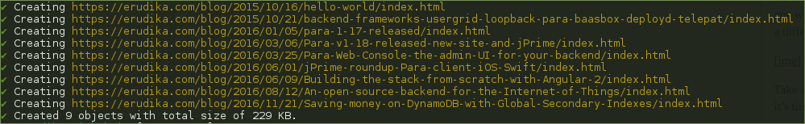
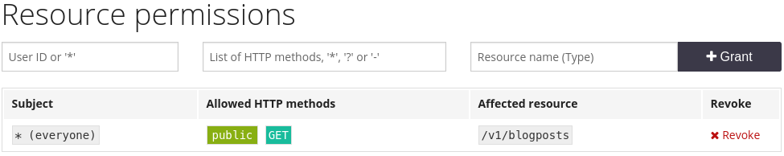

**Static site generators are great** — they get the job done quickly for our blogs, landing pages and project websites.
They make it easy to build something, deploy it and forget it — free hosting, nothing to maintain, a sort of “serverless”
technology. Static sites are perfect for content which rarely changes. They lack dynamic features, but the main problem
is that you can’t search quickly for a piece of content without leaving the site, which hinders the user experience.

We generate our blog using Hexo, a simple static site generator, and we’re quite happy with it. We’ve always felt that
our search box could be improved and sending users off to Google was just sloppy. In this tutorial, I’ll show you how
you can also upgrade the search box on your blog or static site.

<!-- more -->


So we have a bunch of HTML files generated for our site and we need them indexed somewhere so we can query them later.
The search box will send AJAX requests to the search API and presents the results to the user — very simple setup.
So we’ll need three things:

1. a tool for quickly indexing our content;
2. a full-text search API, preferably one that is free;
3. some JavaScript code to call the API and show the results.

Currently, there are several solutions for implementing full-text search. Depending on the time and money you are
willing to spend, you could either host your own search server, like Elasticsearch or Solr, or pay for a service like
Algolia. Now, for something as simple as a blog with ten articles in it, paying for servers or a monthly subscription
fee is a bit excessive. This is where [Para](https://paraio.com) comes in — our flexible, open-source backend service.
It’s absolutely free for developers and the search functionality inside of it is **powered by Elasticsearch** — *sweet!*

Initially, when we started with this task we didn’t have the tool for indexing our blog posts and this lead to us
writing [para-cli](https://github.com/Erudika/para-cli) — a command-line tool for working with our Para backend server.
It’s written in JavaScript for Node.js and it’s really simple to use. Let’s go ahead and install it:

```
$ npm install -g para-cli
# run setup and set endpoint to either 'http://localhost:8080' or 'https://paraio.com'
$ para-cli setup
```

Now you can see all the options by typing `para-cli` in the console. There are several basic commands for reading,
writing and deleting objects and one for search. For now, we’re only interested in the `create` command.

Go over to [ParaIO.com](https://paraio.com/signin) and sign in to get a free account, if you don’t have one already.
Next, we’ll create a new app where we can store our blog posts. If you already have an existing app with some objects
in it, you can still fit in the content of your site by using objects of a different type, like `blogpost`.


Take a note of your Para access and secret keys, we’ll need them for our CLI tool. Now it’s time to gather our HTML
files and send them to Para for indexing.

```
$ para-cli create "blog/20*/**/*.html" --type "blogpost" --sanitize \
--accessKey "app:myapp" --secretKey "[key]"
```


In our case, HTML files are located in a folder called ‘blog’ with subfolders for each year. The CLI tool will parse
every HTML file and look for the these two tags:

```html
<meta property="og:title" content="…">
<meta property="og:url" content="…">
```
Most static site generators, like Octopress and Hexo, automatically include these tags in the code. We’ll also want
to index newly published blog posts, so we can simply execute the command above again and everything will be in sync.
If all went well, we should now have all our content indexed and ready. Let’s test it by sending a search query:

```
$ para-cli search "some keyword" --accessKey "app:myapp" --secretKey "[key]"
```
This should return the results in as an array of JSON objects. Awesome! Now, in order for our client-side JavaScript
widget to be able to be able to access the Para search API without a secret key, we’ll have to allow public access to
the `blogposts` resource.



The search box in our case is implemented with good old jQuery and a plugin called
[typehead.js](https://twitter.github.io/typeahead.js/). The code is very simple — it calls the search API and queries
objects of type `blogpost`. The results are in the form of a JSON object with several properties but we’re only
interested in the objects found so we transform it into an `Array`.

```js
var APPID = "app:myapp";
var ENDPOINT = "https://paraio.com/v1";

$.ajaxSetup({
  headers: {'Authorization': 'Anonymous ' + APPID}
});

var blogposts = new Bloodhound({
  datumTokenizer: Bloodhound.tokenizers.whitespace,
  queryTokenizer: Bloodhound.tokenizers.whitespace,
  remote: {
    url: ENDPOINT + '/blogposts?q=%QUERY',
    wildcard: '%QUERY',
    transform: function (res) {
      return res.items || [];
    }
  }
});

$('#search-box').typeahead({
  hint: false,
  highlight: true,
  minLength: 3
},
{
  name: 'blogposts',
  source: blogposts,
  templates: {
    notFound: '<i>No results.</i>'
  },
  display: function (result) {
    return result.name;
  }
});

$('#search-box').bind('typeahead:select', function (ev, result) {
  window.location = result.url || '';
});
```

Finally we add some CSS styling to make our widget look good. Some of these classes are typehead.js specific but can
also be modified.

```css
#search-box {
  background: #fff;
  width: 100%;
  padding: 10px;
  border-radius: 3px;
  border: 1px solid #ddd;
  font-size: 1.4em;
}
.tt-menu {
  width: 100%;
  margin: 2px 0;
  padding: 5px 10px;
  background-color: #fff;
  border: 1px solid #ccc;
}
.tt-suggestion:last-child {
  border-bottom: none;
}
.tt-suggestion {
  border-bottom: 1px dashed #ccc;
  font-size: 1.4em;
  padding: 10px 0;
}
.tt-suggestion.tt-cursor {
  color: #fff;
  background-color: #0097cf;
}
.twitter-typeahead {
  width: 100%;
}
```

## Final result

*That’s it!* You can try out the finished thing at the top of this page, above the title.
We chose jQuery just because it was already included in our HTML code but you can just as easily achieve the same
result with other JS frameworks like Angular or React.

*If you liked this post, you can also follow us [on Twitter](https://twitter.com/erudika) or chat with us
[on Gitter](https://gitter.im/Erudika/para).*
