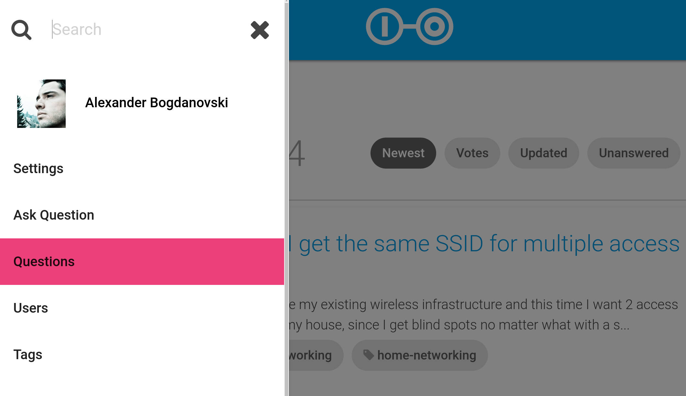

Have you ever wanted to have a Q&A section on your website with the functionality of Stack Overflow? Well, this one is for you! Scoold is a cloud-ready Stack Overflow clone, powered by our Para backend. It's a real-world application, showcasing the Para technology and how it can be utilized to get a project off the ground quickly. Scoold is a lightweight (~4000 LOC) web application written in Java -- it runs great on the smallest Heroku dyno and doesn't require a database.

<!-- more -->


# A brief history of Scoold

I started the project back in 2008. Initially, the idea was to build a social network for schools. Yeah, I know, another Facebook, right? Kinda. The project was already in development around the time when Stack Overflow (SO) launched and I was really inspired by it. In the beginning SO was just this one website and had no themed versions of itself, so I decided to build a version of it for students and teachers, instead of programmers. The project was unsucessful but it gave birth to another project which is now known as [Para](https://paraio.org). Scoold's backend code was extracted to a separate library, refactored and published on GitHub and Maven.

So, for the past few years I was busy developing Para, while Scoold just sat there on my hard drive, doing nothing. I knew it could be useful to somebody and I started refactoring and modernizing it, in January. By mid-February it was out on [GitHub](https://github.com/Erudika/scoold) and redeployed on Heroku (previously it ran on EC2). I've reduced the code significantly by removing old features and just focused on making it work like Stack Overflow.

# Features

So, what can you do on Scoold? It implements most the SO features -- you can ask and answer questions, upvote and downvote posts, earn badges and reputation. Each edit creates an new revision, making it easy to follow the history of edits. The posts can be written in Markdown, which is then rendered by Para to HTML.
The reputation system is simple but effective. People are awarded reputation points for good questions and answers, as well as various badges for their achievements on the site. Not all badges found on SO are implemented, though.


When posting a question, you can attach a location to it -- a nifty feature which is *not* implemented on Stack Overflow. This allows you to filter questions based on their location, making it easy to find those that have been asked in your region. Geolocation queries are implemented through the Elasticsearch `geo_point` data type.


You can search for anything on Scoold because each post is indexed and analyzed by Elasticsearch -- a powerful search engine. You can easily find users, questions and answers from the search bar on top. The search results are paginated, each page showing 30 results (this can be changed in the config file).



I really wanted to keep things simple on the frontend -- a classic, light frontend with jQuery works fine. Scoold used jQuery from the very beginning, and the trusted JavaScript library is still very useful today. It takes care of all theAJAX requests and toggles a bunch of elements on the screen, nothing more. Everything is rendered on the server, just like in the good old days. The content is easily crawlable by search engines which is great for SEO and the URLs are pretty tidy, too.

The design has been completely revamped to have a clean and modern look. The frontend code uses Materialize CSS -- a framework based on Google's Material Design Lite. It's responsive and beautiful. Icons are from FontAwesome. On your profile page you can choose your own picture of use your Gravatar. Logging in is quick, without registration forms or passwords. Initially, Facebook and Google are supported as identity providers, but others are also available, like Microsoft, Twitter and Github (supported by Para).

# Deployment

Scoold, is ready for cloud deployment and can run on any cloud infrastructure or on your own servers. Currently, it runs on Heroku. You can simply click the 'Deploy to Heroku' button below and get up-and-running in minutes. It is a single JAR file (generated by Spring Boot) that is executed like this:

```
java -Dserver.port=$PORT -jar target/scoold*.jar
```
There are a few environment variables that need to be set before deployment. You can find these under the "Settings" tab for your application, click "Reveal Config Vars".
The most important ones are these:

```
para_endpoint = "https://paraio.com"
para_access_key = "app:scoold"
para_secret_key = "*****************"
para_fb_app_id = "123456789"
para_fb_secret = "***********************"
para_google_client_id = "********************************
```
Scoold needs to know the location of a Para server, and to connect, you need your app's access key and secret key (see [Para docs](https://paraio.org/docs)).

[](https://heroku.com/deploy?template=https://github.com/Erudika/scoold)

**The website of the project is [https://scoold.com](https://scoold.com), and the live demo is at [https://demo.scoold.com](https://demo.scoold.com).**


*You can follow Scoold [on Twitter](https://twitter.com/getscoold) or chat with us about it [on Gitter](https://gitter.im/Erudika/scoold).*